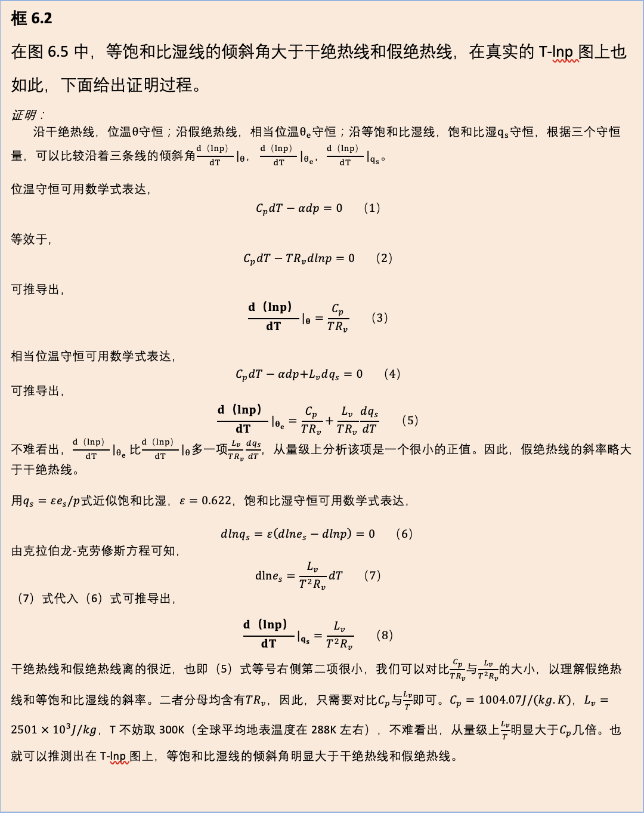

# 大气热力学
## 理想气体定律

$$
p=\rho R T \\
p \alpha =R T
$$

$R$：为比气体常数（$J · g^{-1}K^{-1}$），$R=R^*/M$。$R^*$为摩尔气体常数，$R^*=8.314 J · mol ^{-1}K^{-1}$；$M$的气体相对分子质量($g  ·mol^{-1}$)；$\alpha$为比容，单位质量气体具有的体积。对于干空气，$Rd = R^* / M_d = 8.314 / 28.97 = 0.287\;(J ·g^{-1}K^{-1})$
$$
\alpha dp+pd\alpha=RdT
$$

## 热力学第一定律

> 热力学第一定律：对系统施加的热量等于系统的内能变化和对系统对外做功之和。

对式6，两边同时求微分，可得：
$$
dQ = C_v dT + p d\alpha \\
\dot{Q} = C_{v} \frac{d T}{d t} + p \frac{d \alpha}{d t}
$$

> 距离或者体积$\alpha$不变，则不存在做功，因此上式不包含 $\alpha dp$。

### 定容与定压比热容

1. 定容($d \alpha = 0$)，热量全部转化为内能，$dQ = C_v dT$；

2. 定压($d p = 0$)，一部分能量对外做功。此时：
   $$
   \begin{align}
      dQ &= C_v dT + p d\alpha \\
         &= C_v dT + RdT - \alpha dp \notag, (dp=0) \\
         &= C_v dT + RdT             \notag \\
         &= C_p dT             \notag
   \end{align}
   $$

因此$C_p = C_v + R$。

其中，$C_{v}$、$C_p$分为定容、定压比热容，对于干空气，$C_{v}=0.716 J ·g^{-1} K^{-1}$、$C_p=1.005 J ·g^{-1} K^{-1}$。

## 绝热过程

### 干空气

**在dp不为0情况下**，将$\alpha=\frac{RT}{p}$带入：
$$
\begin{align}
   dQ &= C_v dT + p d\alpha \\
      &= C_v dT + RdT - \alpha dp   \notag \\
      &= C_p dT - \alpha dp         \notag \\
      &= C_p dT - \frac{RT}{p}dp    \notag
\end{align}
$$

即：
$$
dQ= C_p dT - \frac{RT}{p}dp \\
$$

#### 干绝热过程

$$
C_p dT = \frac{RT}{p}dp, dT = \frac{RT}{C_p p}dp \\
C_p \frac{dT} {T} = R \frac{dp} {p} \\

C_p \int_{T_{0}}^{T} \frac{d T}{T}=\int_{p_{0}}^{p} R \frac{d p}{p} \\
ln \frac{T}{T_0} =  ln ( [\frac{p}{p_0}] ^{R/C_p})
$$

因此可得：
$$
T = T_0 * (\frac{p}{p_0}) ^{R/C_p}
$$
上式等价于：
$$
T_0 = T * (\frac{p_0}{p}) ^{R/C_p}
$$
定义1000hpa处的温度为位温$\theta$，则
$$
\theta = T * (\frac{p_0}{p}) ^{R/C_p} \\
= T * (\frac{1000}{p}) ^ {0.288}
$$

#### 干绝热直减率

直减率$\gamma$：每上升单位距离，下降的温度，$-dT/dz$（加负号保证直减率为正）。

准静力学条件下，气块垂直运动过程中，其气压与其周围大气气压相同$(p = - \rho g z + p_0)$。
$$
C_p dT = \frac{RT}{p}dp \\
dT = \frac{RT}{C_p p}dp  \\
$$
将$(p = - \rho g z + p_0)$带入：
$$
\begin{align}
dT &= \frac{RT}{C_p p}dp \\ 
&= - \frac{RT}{C_p p} \rho g dz, (\rho = \frac{p}{R T}) \\
&= - \frac{g}{C_p} dz \\

\gamma_d &= \frac{g}{C_p} = 0.981 / 1.005 ≈ 0.98 K /100m
\end{align}
$$

> 上式，需要把$C_p$转化为$J\;kg^{-1} K^{-1}$

### 湿空气

与干空气相比，湿空气多了凝结释放的潜热。

> 1. **气化潜热：单位质量的液体，气化所需要的热量**；用符号$\lambda$表示。**随温度变化而变化，但变化幅度不大，因此有时认为$\lambda$为常数。**
> 2. 凝结潜热: 单位质量的气体，凝结所释放的热量。
> 
> 气化与凝结互为反过程。

气化潜热的公式如下：
$$
\lambda =2499.5-2.39T, \;(J·g^{-1})
$$

湿空气达到饱和后，有部分水汽会发生凝结。凝结过程中，**水汽含量下降，$d{q_s}<0$**，因此乘以$-\lambda$表示释放的能量。

$$
\begin{align}
   dQ - \lambda d{q_s} &= C_p dT - \frac{RT}{p}dp
\end{align}
$$

#### 湿绝热过程

真实大气上升过程分为两部分：

1. 水汽饱和之前：沿干绝热过程移动
2. 水汽饱和之后：沿湿绝热过程移动

$$
\begin{align}
ln \theta &= ln T + \frac{R}{C_p} ln(\frac{p_0}{p})  \\
		  &= ln T - \frac{R}{C_p} ln p + \frac{R}{C_p} ln(p_0) \\
          &= ln T - \frac{R}{C_p} ln p + const
\end{align}
$$

根据上式可以得到：
$$
d {ln(\theta)} = \frac{d\theta}\theta = C_p \frac{dT}{T}  - \frac{R}{C_p} \frac{dp}{p}
$$

##### 推导方法1

$$
- \lambda d{q_s} = C_p dT - \frac{RT}{p}dp \\
  - \frac{\lambda d{q_s}}{T} = C_p \frac{dT}{T} - R\frac{dp}{p} \\
  - \frac{\lambda d{q_s}}{C_p T} = \frac{d\theta}\theta \\
  ln (\theta / \theta_0) =  - \frac{\lambda (q - q_0)}{C_p T} \\ 
  \theta = \theta_0 e ^{- \frac{\lambda (q - q_0)}{C_p T}}
$$

**地表1000hPa处的温度，定义为位温；不论地表是否饱和、还是非饱和**。

湿绝热的位温$\theta_e$来表示，
$$
\theta_e=T (\frac{p_{0}}{1000} )^{\frac{R}{c_{p}}} e^{\frac{-\lambda (q-q_{0} )}{c_{p}}}
= \theta e^{\frac{-\lambda(q-q_{0})}{c_{p}}}
$$

**假相当位温：**

##### 推导方法2

$$
- \lambda d{q_s} = C_p dT - \frac{RT}{p}dp \\
- \frac{\lambda d{q_s}} {C_p T} = \frac{dT} {T} - \frac{R}{C_p p}dp \\
$$

从地表$(T_0, P_0, q_0)$到大气某一高程$(T, P, q_s)$的过程，进行积分：

q随温度会发生变化。q_s和温度有关系，但是和气压无关系。

**上述积分的假设：**

> $q_s$的变化速率远大于$T$或 $\lambda$的变化速率。
>
> For a saturated parcel undergoing pseudoadiabatic ascent, the rate of change in $q_s$ following the motion is much larger than the rate of change in $T$ or $\lambda$.  <u>**(*James R. Holton, 2013*)**.</u>

#### 湿绝热直减率

$$
- \frac{dT}{dz} = \frac{g}{c_p} + \frac{L}{c_p} \frac{d q_s}{dz}
$$
> 详细证明过程见：<u>*葛朝霞, 2013, 章节3.3.2.2, P66*</u>

结论：

湿绝热过程中，水汽下降，释放潜热，温度下降慢；因此$\gamma_s < \gamma_d$。

## 热力图的应用（重点）

### $T-lnp$图

[q与P, 和T的关系](image/03-大气热力学/skew_T_公式推导.png)
> 上述推导来源于：大气系赵树云老师
<!--  -->

$$
d (lnp) | q_s = \frac{L_v}{T^2 R_v} {dT} \\
lnp | q_s = b - \frac{L_v}{R_v T} \\
% 将地表的状态量带入
ln(p)| q_s = ln p_0 + \frac{L_v}{R_v T_0}  - \frac{L_v}{R_v T}
$$
